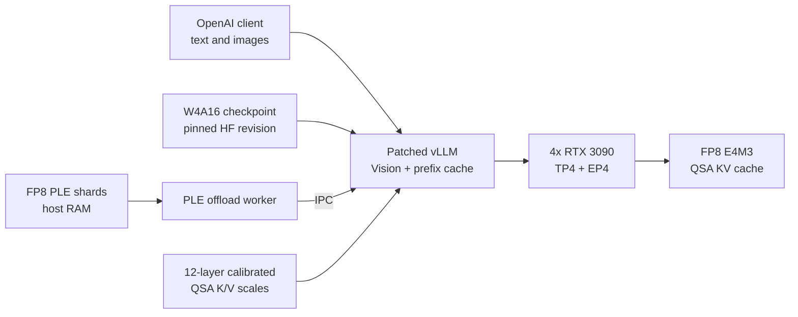

<div align="center">

# Qwen3.8-Flash-Next on 4x RTX 3090

**A one-command vLLM stack for Qwen3.8-Flash-Next 122B / 51B active with Vision and a 262K configured context window.**

[](#hardware-and-storage)
[](#hardware-and-storage)
[](#verified-context)
[](#validation)
[](#stack)
[](#stack)
[](LICENSE)
[](#reproducibility-boundary)

[Quick start](#quick-start) · [Benchmarks](#speed-on-4x-rtx-3090) · [Architecture](#stack) · [Configuration](#configuration) · [Raw results](benchmarks/2026-08-28/)

</div>

This repository packages the exact runtime composition used to fit the model,
Vision module, FP8 PLE and FP8 QSA KV cache across four 24 GB Ampere cards. It
keeps prefix caching enabled and runs compiled CUDA graphs without
`--enforce-eager` or `--language-model-only`.

## Quick start

```bash
git clone https://github.com/alesha-pro/qwen38-flash-next-4x3090.git
cd qwen38-flash-next-4x3090
./run_qwen_next.sh
```

The first run downloads about 237 GB from two pinned Hugging Face revisions,
checks the files, starts vLLM, waits for `/health`, then sends one text request
and one Vision request. Later starts reuse the same files.

The OpenAI-compatible endpoint listens on `http://127.0.0.1:8018/v1` by
default.

```bash
curl http://127.0.0.1:8018/v1/models
```

Stop this stack without touching other containers:

```bash
./stop_qwen_next.sh
```

## Speed on 4x RTX 3090

All numbers below come from the saved 2026-08-28 suite at 220 W per GPU. Every
request contained a real image. The server used TP4+EP4, FP8 QSA KV, FP8 PLE,
prefix caching, `VLLM_COMPILE` and `FULL_AND_PIECEWISE` CUDA graphs. Eager mode
and MTP were off. Each reported cell is the median of three measured repeats
after warmup.

### Single-request speed by depth

| Target depth | Served input | Prefill TTFT | Prefill rate | Decode rate |
|---:|---:|---:|---:|---:|
| 4K | 3,979 tokens | 2.12 s | 1,877 tok/s | 65.8 tok/s |
| 32K | 32,644 tokens | 16.70 s | 1,955 tok/s | 65.5 tok/s |
| 128K | 130,945 tokens | 71.32 s | 1,836 tok/s | 69.2 tok/s |
| 192K | 196,486 tokens | 110.86 s | 1,772 tok/s | not measured |
| max | 260,578 tokens | 162.85 s | 1,600 tok/s | 66.3 tok/s |

The prefill and decode columns use separate matched arms with 16 generated
tokens for prefill and up to 256 for decode. At maximum depth, the dedicated
single-request run produced a median `67.0 tok/s`, `15.42 ms` TPOT and
`165.5 s` end-to-end latency with 260,578 image-bearing input tokens.

### Concurrent generation

| Input depth | Concurrency | Successful requests | Aggregate generation | TTFT p50 / p95 |
|---:|---:|---:|---:|---:|
| 4K | 1 | 3 / 3 | 63.7 tok/s | 2.03 / 2.04 s |
| 4K | 2 | 6 / 6 | 75.6 tok/s | 3.98 / 7.16 s |
| 4K | 4 | 12 / 12 | 83.6 tok/s | 6.07 / 7.99 s |
| 4K | 8 | 24 / 24 | 88.2 tok/s | 10.15 / 15.83 s |
| 32K | 1 | 3 / 3 | 10.9 tok/s | 16.58 / 16.68 s |
| 32K | 8 | 24 / 24 | 11.4 tok/s | 84.44 / 133.42 s |
| 131K | 2 | 6 / 6 | 2.7 tok/s | 142.45 / 142.52 s |

At 32K and above, chunked scheduling serializes much of the prefill work.
Concurrency still fits, but decode pauses behind other requests' prefill, so
aggregate generation barely moves.

### FP8 QSA KV against BF16 KV

This matched control used the same image-bearing 130,945-token prompt and
three measured repeats per arm.

| Metric | BF16 KV | FP8 QSA KV | Change |
|---|---:|---:|---:|
| KV capacity | 139,628 tokens | 256,840 tokens | +83.9% |
| TTFT | 70.20 s | 70.45 s | +0.4% |
| TPOT | 15.53 ms | 14.80 ms | -4.7% |
| Decode | 67.59 tok/s | 70.93 tok/s | +4.9% |
| Captured image answer | 3 / 3 correct | 3 / 3 correct | matched |

The stored output tails captured the image answer in all six requests. They did
not retain enough text to score needle recall for this specific A/B control, so
that comparison remains a measurement gap. The long-context acceptance tests
covered needle recall separately.

The [environment record](benchmarks/2026-08-28/environment.txt) and
[raw JSONL](benchmarks/2026-08-28/raw/) are committed with the repository.

## Verified context

| Measurement | Result |
|---|---:|
| Configured `max_model_len` | 262,144 |
| vLLM FP8 KV capacity | 263,699 tokens |
| Maximum served image-bearing input | 261,591 tokens |
| Decode allowance in that request | 264 tokens |

The capacity printed at startup is only an allocator estimate. The useful
result is the completed request containing text padding, a late needle and a
real image while Vision and compiled CUDA graphs stayed on.

## Stack



| Component | Effective setting |
|---|---|
| Main checkpoint | [`VnimanieAI/Qwen3.8-Flash-Next-W4A16`](https://huggingface.co/VnimanieAI/Qwen3.8-Flash-Next-W4A16) |
| External PLE | selected FP8 shards from [`RadixArk/Qwen3.8-Flash-Next-NVFP4`](https://huggingface.co/RadixArk/Qwen3.8-Flash-Next-NVFP4) |
| Parallelism | tensor parallel 4, expert parallel 4 |
| KV cache | calibrated FP8 E4M3 on the QSA path |
| Compilation | `VLLM_COMPILE` |
| CUDA graph mode | `FULL_AND_PIECEWISE` |
| Vision | enabled |
| Prefix caching | enabled |
| Eager mode | disabled |
| MTP | disabled |

The launcher verifies the pinned container image and the original QSA file
hashes before it mounts any overlay. PLE validation checks the HF revision,
file sizes, tensor metadata, the BF16 scale tensor and sampled FP8 shard data.
See [PATCH-MAP.md](PATCH-MAP.md) and [SOURCE-MAP.md](SOURCE-MAP.md) for file
ownership and provenance.

## Hardware and storage

| Resource | Minimum | Recommended |
|---|---:|---:|
| GPU | 4x RTX 3090 | 4x RTX 3090 |
| Aggregate VRAM | 96 GB | 96 GB |
| System RAM | 64 GB, theoretical | 128 GB |
| Free model storage | 250 GB | 300 GB |

The 64 GB RAM figure has not been validated on hardware. The external FP8 PLE
worker used about 49.2 GiB RSS in the reference run, which leaves little room
for Linux and the remaining runtime processes. The measured host had 125 GB of
RAM and no swap activity.

You also need Linux x86_64, Docker, NVIDIA Container Toolkit and a recent
NVIDIA driver. The script refuses to launch when another compute process owns
the GPUs or when the selected TCP port is busy. It never changes the GPU power
limit.

## Configuration

Copy `.env.example` to `.env`, or pass variables directly:

```bash
QWEN38_MODELS_ROOT=/mnt/ssd/models \
MAX_MODEL_LEN=262144 \
MAX_NUM_SEQS=1 \
MAX_NUM_BATCHED_TOKENS=512 \
KV_CACHE_DTYPE=fp8_e4m3 \
./run_qwen_next.sh
```

| Variable | Default | Purpose |
|---|---|---|
| `QWEN38_MODELS_ROOT` | `~/.cache/qwen38-flash-next-4x3090/models` | checkpoint storage |
| `HOST` | `127.0.0.1` | vLLM bind address |
| `PORT` | `8018` | OpenAI API port |
| `MAX_MODEL_LEN` | `262144` | configured context |
| `MAX_NUM_SEQS` | `1` | safest full-context profile |
| `MAX_NUM_BATCHED_TOKENS` | `512` | scheduler token budget |
| `GPU_MEMORY_UTILIZATION` | `0.92` | vLLM memory fraction |
| `KV_CACHE_DTYPE` | `fp8_e4m3` | QSA KV cache dtype |
| `SKIP_SMOKE` | `0` | set to `1` to skip post-start requests |

Use existing checkpoints without another download:

```bash
MODEL_DIR=/path/to/Qwen3.8-Flash-Next-W4A16 \
PLE_MODEL_DIR=/path/to/Qwen3.8-Flash-Next-NVFP4 \
./run_qwen_next.sh
```

Static validation and download-only modes do not start the model:

```bash
./run_qwen_next.sh --check-only
./run_qwen_next.sh --download-only
```

## Validation

The frozen smoke battery covers plain text, arithmetic, OCR, chart reading,
spatial relationships, a fine-detail grid and a two-image comparison. The
integrated stack passed all seven checks. The default launcher runs a shorter
text plus OCR pair after every successful startup.

<details>
<summary>Reference revisions and image identity</summary>

| Artifact | Pinned identity |
|---|---|
| Runtime image | `vllm/vllm-openai:qwen38-flash-next` |
| Runtime image ID | `sha256:fc120ece0a388cc0aa1caad4a9f1cd92113484ab7ec2fd0efadd62585be05bf8` |
| vLLM | `0.1.dev20073+g8e685d198` |
| W4A16 revision | `9236d703b25f25eb5c17e9640204f84fa1ce0c6e` |
| FP8 PLE revision | `7b719225242aacd3dbd3f9407468c2ee9a9d2594` |

</details>

## Reproducibility boundary

This is an Ampere-specific research runtime built from pinned vLLM overlays.
FP8 KV on this QSA path is not an upstream vLLM feature. A newer image may move
or change the patched files, so the launcher fails closed when their hashes no
longer match.

The code and runtime patches in this repository use the
[Apache License 2.0](LICENSE). The two model repositories keep their own model
cards, terms and licenses.

## Credits

- [Qwen](https://huggingface.co/Qwen) for Qwen3.8-Flash-Next.
- [VnimanieAI](https://huggingface.co/VnimanieAI) for the W4A16 checkpoint.
- [RadixArk](https://huggingface.co/RadixArk) for the NVFP4 checkpoint used as the FP8 PLE source.
- [vLLM](https://github.com/vllm-project/vllm) for the serving runtime.
